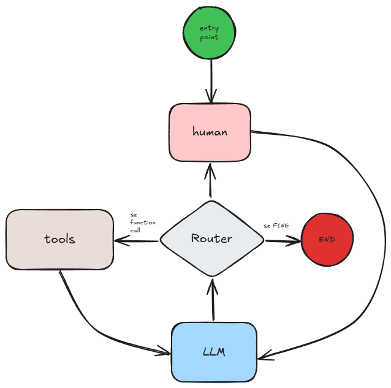

# Computer

## Inizializzazione
1. crea un ambiente python e installa le dipendenze con il comando
```bash
pip install -r requirements.txt
```
2. crea un file .env con il seguente contenuto
```
OPENAI_API_KEY="openai-key"
TAVILY_API_KEY="tavily-key"
```
3. potrebbe essere necessario installare ffmpeg:
- **windows**: si suggerisce questa [guida](https://phoenixnap.com/kb/ffmpeg-windows)
- **linux**: si suggerisce questa [guida](https://phoenixnap.com/kb/install-ffmpeg-ubuntu)
4. Avviare con il comando:
```bash
python src/main.py
```

## Descrizione
**Computer** è un prototipo di assistente vocale (tipo Google Home o Alexa) costruito con le moderne tecniche di Agentic AI.
L'agente è stato costruito con la libreria [Langgraph](https://langchain-ai.github.io/langgraph/), il grafo che ne descrive il flusso è mostrato nella seguente immagine:



## Tools
L'agente è in grado di utilizzare i seguenti tool:
1. Ricerca sul web grazie all'API [Tavily](https://tavily.com/)
2. Aggiungere elementi alla lista della spesa
3. Leggere l'attuale lista della spesa
4. Fornire l'oroscopo, che viene letto tramite web scraping dal sito del [https://www.corriere.it/oroscopo/oggi/](https://www.corriere.it/oroscopo/oggi/)
Questi tool sono stati creati a puro scopo sperimentale, per testare le potenziali capacità di un sistema di questo tipo.

## Modelli
Il progetto comprende l'integrazione di diversi modelli di AI:
1. VAD ([Voice Activity Detector - Silero VAD](https://github.com/snakers4/silero-vad)):
Questo modello permette di individuare l'attività vocale, è fondamentale per capire quando l'utente ha iniziato a parlare.
2. STT ([Speech To Text - Faster Whisper](https://github.com/SYSTRAN/faster-whisper)):
Per tradurre in testo la voce registrata.
3. TTS ([Text To Speech - Pyttsx3](https://pypi.org/project/pyttsx3/)):
Per tradurre in audio la risposta dell'LLM.
4. LLM ([Large Language Model - ChatGPT](https://platform.openai.com/docs/api-reference/introduction)):
E' l'intelligenza artificiale in grado di utilizzare i tool a disposizione per risolvere le richieste dell'utente.

## Futuri Miglioramenti
- Integrazione di un wake-word model per attivare il sistema tramite un preciso comando vocale (come "Alexa!", "Eih Siri!", "Ok Google!")
- Emancipazione dell'API di ChatGPT per passare ad un modello opensource, i risultati più promettenti sono stati ottenuti con [Qwen-14B](https://github.com/QwenLM/Qwen2.5-Coder), che nella sua versione quantizzata, in 16Gb di GPU, dimostra capacità di Agent perfettamente paragonabili a ChatGPT4 per questo sistema
- Integrazione di tool più funzionali ad un assistente vocale, come ad esempio il collegamento a Spotify.
- Creazione di un'interfaccia a frontend.

## Posts
Di seguito i post su Linkedin relativi al progetto:
1. [Prima implementazione](https://www.linkedin.com/posts/federico-di-credico-242279a5_il-reale-valore-dei-llm-%C3%A8-la-loro-capacit%C3%A0-activity-7236781670270423040-muQc?utm_source=share&utm_medium=member_desktop)
2. [Implementazione su Raspberry](https://www.linkedin.com/posts/federico-di-credico-242279a5_llm-raspberry-pi-agents-activity-7244079306367262720-K-2E?utm_source=share&utm_medium=member_desktop)
3. [VAD - Voice Activity Detector](https://www.linkedin.com/posts/federico-di-credico-242279a5_voice-activity-detector-quando-si-costruisce-activity-7257460265577824258-fwlV?utm_source=share&utm_medium=member_desktop)